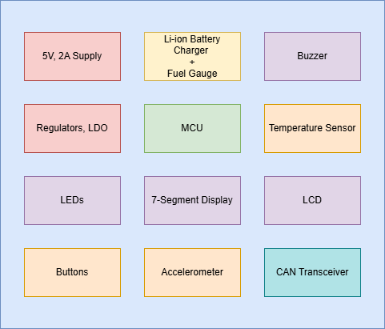

# RJX Embedded Training Kit

    

Hardware training platform built around **STM32L431** with:
- **5 V input** and dual **3.3 V rails** (digital +3V3 and analog +3V3A)
- **Li-ion charger/power-path** + **fuel gauge**
- Sensors (I2C/SMBus + SPI), UI peripherals (LCD/7-seg/buzzer), and **CAN**

This repository contains the complete **KiCad 9** hardware design, PDFs/datasheets, and the STM32CubeMX pinout file.

---

## Repository layout

```text
.
├── LICENSE
├── README.md
├── images
│   └── rjx_training_kit.png
├── pinout
│   └── pinout.ioc
└── rjx_training_kit
    ├── Docs         (schematic PDF, datasheets, links)
    ├── Hardware     (KiCad project: schematics + PCB)
    ├── Libs         (project libraries)
    └── Outputs
```

---

## Quick start

### View / edit hardware (KiCad 9)
1. Install **KiCad v9** (recommended).
2. Open the project:
   - `rjx_training_kit/Hardware/rjx_training_kit.kicad_pro`
3. Schematic sheets:
   - Top-level: `rjx_training_kit/Hardware/rjx_training_kit.kicad_sch`
   - Sub-sheets: `rjx_training_kit/Hardware/microcontroller.kicad_sch`, `rjx_training_kit/Hardware/peripherals.kicad_sch`
4. PCB layout:
   - `rjx_training_kit/Hardware/rjx_training_kit.kicad_pcb`

### View pin configuration (STM32CubeMX)
- Open `pinout/pinout.ioc` in **STM32CubeMX**.

---

## Documentation

### Schematic PDF
- `rjx_training_kit/Docs/rjx_training_kit.pdf`

### Component datasheets
Datasheets used by the design are stored in:
- `rjx_training_kit/Docs/`

### External links
External forum references and troubleshooting links are maintained here:
- [Links.md](rjx_training_kit/Docs/Links.md)

---

## License
GPL-3.0 (see `LICENSE`).